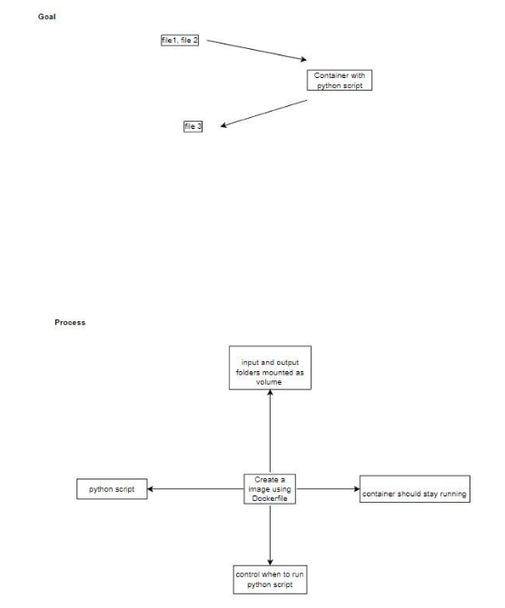

# Data Processing Using Docker

## Overview
In this project, a Docker container was created to streamline the process of data handling and processing. The objective was to develop a containerized solution that efficiently reads data from specified input files and writes the processed results to designated output files.

## Project Steps

1. **Setup and Initialization**
   - The project began by downloading an initial package containing the necessary resources, including folders for input and output data as well as a Python script designed for data processing.

2. **Container Configuration**
   - A Dockerfile was crafted to define the environment and behavior of the Docker container. The Docker image was built to include the Python script, which processes the CSV files located in the input folder.

3. **Data Management**
   - The input folder contains two CSV files (`t1.csv` and `t2.csv`) that are read by the Python script. 
   - The output folder is used to store the results generated by the script. 

4. **Mounting Folders**
   - The input and output folders were mounted from the host machine to the container, allowing for seamless data exchange between the host and the containerized environment.

5. **Execution Flow**
   - The container was configured to remain running without executing the Python script immediately upon startup. Instead, the script was executed later through the `docker exec` command, allowing for controlled data processing on demand.

6. **Results and Repository**
   - The final CSV output file was generated and uploaded to the designated GitHub repository along with the Dockerfile, ensuring that the project deliverables were properly documented and shared.

## ETL Architecture



## Conclusion
This project successfully demonstrates the use of Docker for efficient data processing, highlighting the benefits of containerization in managing and executing data workflows.

## Commands used
```bash
# Copy the files required for the project from local system to server via sftp
put -r ./question DataEngineering_Data_Processing_Using_Docker/
# docker build
docker build -t dataextraction:latest .
# run the container
docker run --rm -d --name dataecontainer dataextraction:latest
# run the python file
docker exec dataecontainer python data/py_script.py
# stop the container; this will also remove the container as we used rm in the run command
docker stop dataecontainer
```
